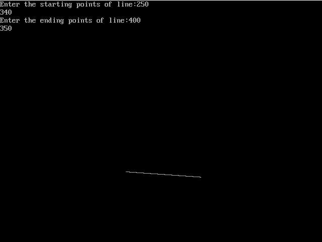
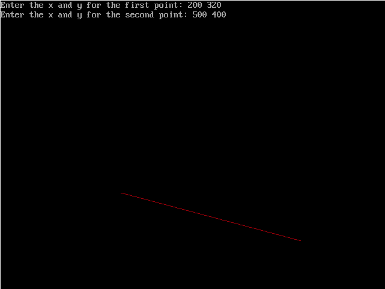

# Practical 2

## Implementation of DDA and Bresenham's line drawing algorithm

### by Akshay Prabhat Mishra

<br/><hr/>

### Sourcecode of Bresenham's line drawing algorithm

```c
#include <conio.h>
#include <stdio.h>
#include <graphics.h>
void main()
{
    int gd = DETECT, gm;
    float x, y, dx, dy, p;
    int x0, x1, y0, y1;
    initgraph(&gd, &gm, "C:\\TC\\BGI");

    printf("Enter the starting points of line:");
    scanf("%d%d", &x0, &y0);
    printf("Enter the ending points of line:");
    scanf("%d%d", &x1, &y1);
 
    dx=x1-x0;  
    dy=y1-y0;  
    x=x0;  
    y=y0;  
    p=2*dy-dx;  
    while(x<x1)  
    {  
        if(p>=0)  
        {  
            putpixel(x,y,7);  
            y=y+1;  
            p=p+2*dy-2*dx;  
        }  
        else  
        {  
            putpixel(x,y,7);  
            p=p+2*dy;
            x=x+1;  
        }  
    }  
    getch();
    closegraph(); 
}
```

### Output



<br/><hr/>

### Sourcecode of DDA line drawing algorithm

```c
#include<graphics.h>
#include<conio.h>
#include<stdio.h>
void main()
{
    int gd = DETECT ,gm,i;
    float x, y,dx,dy,steps;
    int x0, x1, y0, y1;
    initgraph(&gd, &gm, "C:\\TC\\BGI");
    printf("Enter the x and y for the first point: ");
    scanf("%d%d",&x0,&y0);
    printf("Enter the x and y for the second point: ");
    scanf("%d%d",&x1,&y1);
    dx = (float)(x1 - x0);
    dy = (float)(y1 - y0);
    if(dx>=dy)
	   {
	steps = dx;
    }
    else
	   {
	steps = dy;
    }
    dx = dx/steps;
    dy = dy/steps;
    x = x0;
    y = y0;
    i = 1;
    while(i<= steps)
    {
	putpixel(x, y, RED);
	x += dx;
	y += dy;
	i=i+1;
    }
    getch();
    closegraph();
}
```

### Output


