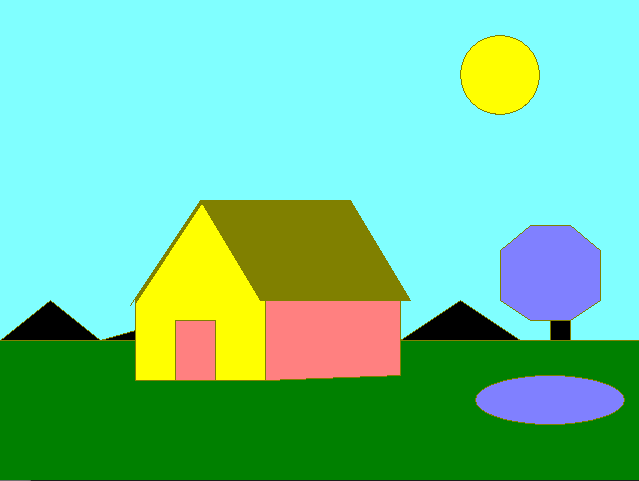

# Practical 1

## by Akshay Prabhat Mishra

### Aim: Study of fundamental graphics functions

### Source Code:

```c++
#include<graphics.h>
#include<conio.h>

int main()
{
    system("cls");
    int gd=DETECT,gm;
    initgraph(&gd,&gm,"");

    setcolor(BROWN);

    int arr01[]={0,340,50,300,100,340,135,330};
    drawpoly(4,arr01);
    int arr02[]={400,340,460,300,520,340,400,340};
    drawpoly(4,arr02);

    int arr1[]={200,200,350,200,410,300,260,300,200,200};
    drawpoly(5,arr1);

    int arr2[]={135,300,135,380,265,380,265,300};
    drawpoly(4,arr2);

    int arr3[]={265,380,400,375,400,300};
    drawpoly(3,arr3);

    line(200,200,130,305);
    line(202,202,135,303);

    line(400,340,700,340);
    line(0,340,135,340);

    circle(500,75,40);

    rectangle(175,380,215,320);

    ellipse(550,400,0,360,75,25);
    setfillstyle(1,LIGHTBLUE);
    fillellipse(550,400,75,25);

    rectangle(550,320,570,340);

    //setcolor(GREEN);
    int arr4[]={530,320,570,320,600,300,600,250,570,225,530,225,500,250,500,300,530,320};
    drawpoly(9,arr4);
    fillpoly(8,arr4);

    setfillstyle(1,BROWN);
    floodfill(200,201,BROWN);

    setfillstyle(1,BROWN);
    floodfill(300,250,6);

    setfillstyle(1,YELLOW);
    floodfill(200,210,6);

    setfillstyle(1,12);
    floodfill(300,310,6);

    setfillstyle(1,12);
    floodfill(200,330,6);

    setfillstyle(1,GREEN);
    floodfill(200,400,6);

    setfillstyle(1,LIGHTCYAN);
    floodfill(100,100,6);

    setfillstyle(1,14);
    floodfill(500,100,6);

    setfillstyle(1,YELLOW);
    floodfill(500,100,YELLOW);

    getch();
    closegraph();
}
```

### Output:<br/>
