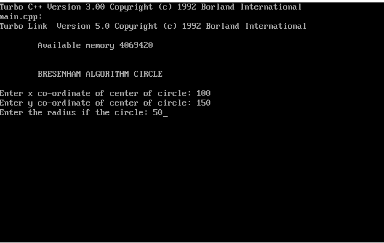
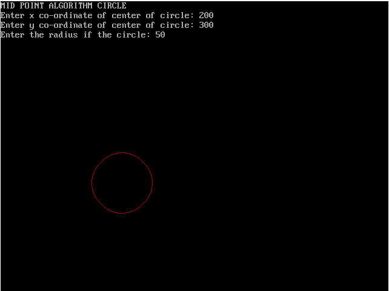

# Practical 3

## Implementation of Bresenham's and Mid-Point Circle drawing algorithm

### by Akshay Prabhat Mishra

<br/><hr/>

### Sourcecode of Bresenham's Circle drawing algorithm

```c
//BRESENHAM

#include <stdio.h>
#include <graphics.h>
#include <conio.h>
#include <dos.h>

void drawcircle(int xc, int yc, int x, int y)
{
    putpixel(xc+x, yc+y, YELLOW);
    putpixel(xc-x, yc+y, YELLOW);
    putpixel(xc+x, yc-y, YELLOW);
    putpixel(xc-x, yc-y, YELLOW);
    putpixel(xc+y, yc+x, YELLOW);
    putpixel(xc-y, yc+x, YELLOW);
    putpixel(xc+y, yc-x, YELLOW);
    putpixel(xc-y, yc-x, YELLOW);
}

void circlebresenham(int xc, int yc, int r)
{
    int x = 0, y = r;
    int d = 3 - 2 * r;
    drawcircle(xc, yc, x, y);
    while (y >= x){ x++;
        if (d < 0)
        {
            d = d + 4 * x + 6;
        }
        else
        {
            y--;
            d = d + 4 * (x - y) + 10;
        }
        drawcircle(xc, yc, x, y);
        delay(50);
    }
}

int main()
{
    int xc, yc, r;
    printf("\n\n\tBRESENHAM ALGORITHM CIRCLE\n");
    printf("\nEnter x co-ordinate of center of circle: ");
    scanf("%d", &xc);
    printf("Enter y co-ordinate of center of circle: ");
    scanf("%d", &yc);
    printf("Enter the radius if the circle: ");
    scanf("%d", &r);
    
    int gd = DETECT, gm;
    initgraph(&gd, &gm, "C:\\TC\\BGI");
    
    circlebresenham(xc, yc, r);
    getch();
    closegraph();
    return 0;
}
```

### Output




<br/><hr/>

### Sourcecode of Mid-Point Circle drawing algorithm

```c
//MID-POINT

#include<stdio.h>
#include<graphics.h>

void drawcircle(int xc, int yc, int x, int y)
{
    putpixel(xc+x, yc+y, RED);
    putpixel(xc-x, yc+y, RED);
    putpixel(xc+x, yc-y, RED);
    putpixel(xc-x, yc-y, RED);
    putpixel(xc+y, yc+x, RED);
    putpixel(xc-y, yc+x, RED);
    putpixel(xc+y, yc-x, RED);
    putpixel(xc-y, yc-x, RED);
}

void circlemidpoint(int xc, int yc, int r)
{
    int x = 0, y = r;
    int p = 1 - r;
    drawcircle(xc, yc, x, y);
    while (y >= x)
    {
        x++;
        if (p < 0) p = p + 2*x + 3;
        else
        {
            y--;
            p = p + 2*x - 2*y + 5;
        }
        drawcircle(xc, yc, x, y);
        delay(50);
    }
}

int main()
{
    int xc, yc, r;
    int gd = DETECT, gm;
    initgraph(&gd, &gm, "C:\\TC\\BGI");
    printf("MID POINT ALGORITHM CIRCLE\n");
    printf("Enter x co-ordinate of center of circle: ");
    scanf("%d", &xc);
    printf("Enter y co-ordinate of center of circle: ");
    scanf("%d", &yc);
    printf("Enter the radius if the circle: ");
    scanf("%d", &r);
    circlemidpoint(xc, yc, r);
    getch();
    closegraph();
    return 0;
}
```

### Output


