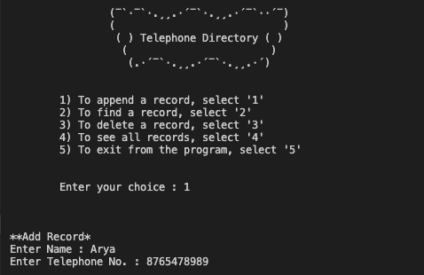
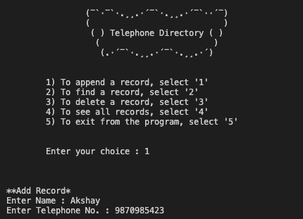
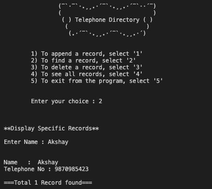
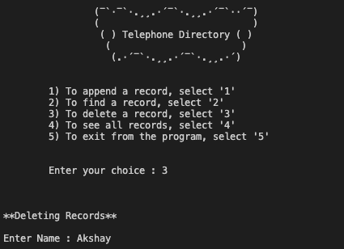
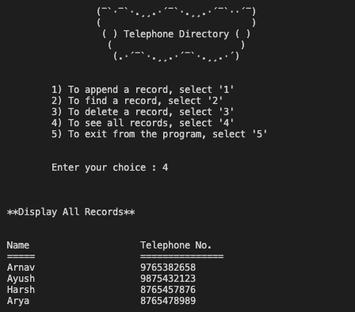
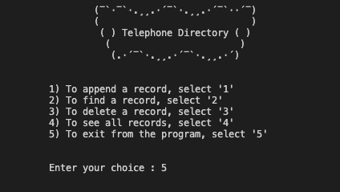

# Mini-Project

**Name**: *Akshay Prabhat Mishra*

**Roll no.**: *00611502720*

**Class**: *CSE-1*

**Topic**: *Telephone Directory*

## Source code

```c
#include<stdio.h>
#include<string.h>
#include<stdlib.h>

struct person
{
   char name[20];
   long int telno;
};

void appendData()
{
   FILE *fp;
   struct person obj;
   fp=fopen("data.txt","a");
   fflush(stdin);
   printf("**Add Record*\n");
   printf("Enter Name : ");
   scanf("%s",obj.name);
   printf("Enter Telephone No. : ");
   scanf("%ld",&obj.telno);
   fprintf(fp,"%s %ld",obj.name,obj.telno);
   fclose(fp);
}

void showAlldata()
{
   FILE *fp;
   struct person obj;
   fp=fopen("data.txt","r");
   fflush(stdin);
   printf("**Display All Records**\n");
   printf("\n\nName\t\t\tTelephone No.");
   printf("\n=====\t\t\t===============\n");
   while(!feof(fp))
   {
   fscanf(fp,"%s %ld",obj.name,&obj.telno);
   printf("%s\t\t\t%ld\n",obj.name,obj.telno);
   }
   fclose(fp);
      
}
void delete()
{
   FILE *fp,*fd;
   struct person obj;
   char name[20];
   int flag=0;
   char old_name[] = "data.txt";
   char new_name[] = "temp.txt";
   fp=fopen("data.txt","r");
   fd=fopen("temp.txt","w");
   fflush(stdin);
   printf("**Deleting Records**\n");
   printf("\nEnter Name : ");
   scanf("%s",name);
   while(!feof(fp))
   {
      fscanf(fp,"%s %ld",obj.name,&obj.telno);
      if(strcmp(obj.name,name)!=0)
      {
         fprintf(fd,"%s %ld",obj.name,obj.telno);
      }
   }
   fclose(fd);
   fclose(fp);
   remove(old_name);
   rename(new_name,old_name); 
}

void findData()
{
   FILE *fp;
   struct person obj;
   char name[20];
   int flag=0;
   fp=fopen("data.txt","r");
   fflush(stdin);
   printf("**Display Specific Records**\n");
   printf("\nEnter Name : ");
   scanf("%s",name);
   while(!feof(fp))
   {
   fscanf(fp,"%s %ld",obj.name,&obj.telno);
      if(strcmp(obj.name,name)==0)
      {
     printf("\n\nName   :  %s",obj.name);
     printf("\nTelephone No : %ld",obj.telno);
     flag++;
      }
   }
   if(flag==0)
      printf("\n\n\nNo Data Found");
   else
      printf("\n\n===Total %d Record found=== \n",flag);
   fclose(fp);
}


int main()
{
   int choice;
   while(1)
   {
      printf("\n\t\t(¯`·¯`·.¸¸.·´¯`·.¸¸.·´¯`··´¯)\n");
      printf("\t\t(                           )\n");
      printf("\t\t ( ) Telephone Directory ( )\n"); 
      printf("\t\t  (                       )  \n");
      printf("\t\t   (.·´¯`·.¸¸.·´¯`·.¸¸.·´)   \n\n");
      printf("\n\t1) To append a record, select '1'\n");
      printf("\t2) To find a record, select '2'\n");
      printf("\t3) To delete a record, select '3'\n");
      printf("\t4) To see all records, select '4'\n");
      printf("\t5) To exit from the program, select '5'\n");
      printf("\n\n\tEnter your choice : ");
      scanf("%d",&choice);
      printf("\n\n\n");
      switch(choice)
      {
         case 1 :
            appendData();
            break;
         case 2 :
            findData();
            break;
         case 3 :
            delete();
            break;
         case 4 :
            showAlldata();
            break;
         case 5 :
            exit(0);
         default: 
            printf("\n Option does not exist! Terminating session...\n\n");
            exit(1);
      }
   }
   return 0;
}
```

## Output

<table>
   <tr>
      <td>
         
      </td>
      <td>
         
      </td>
   </tr>
   <tr>
      <td>
         
      </td>
      <td>
         
      </td>
   </tr>
   <tr>
      <td>
         
      </td>
      <td>
         
      </td>
   </tr>
</table>